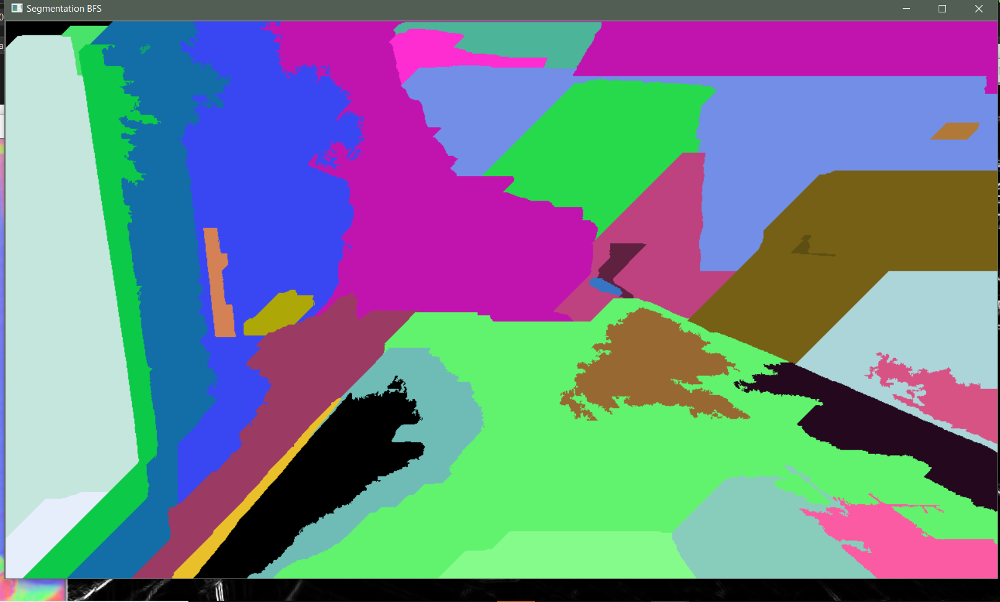
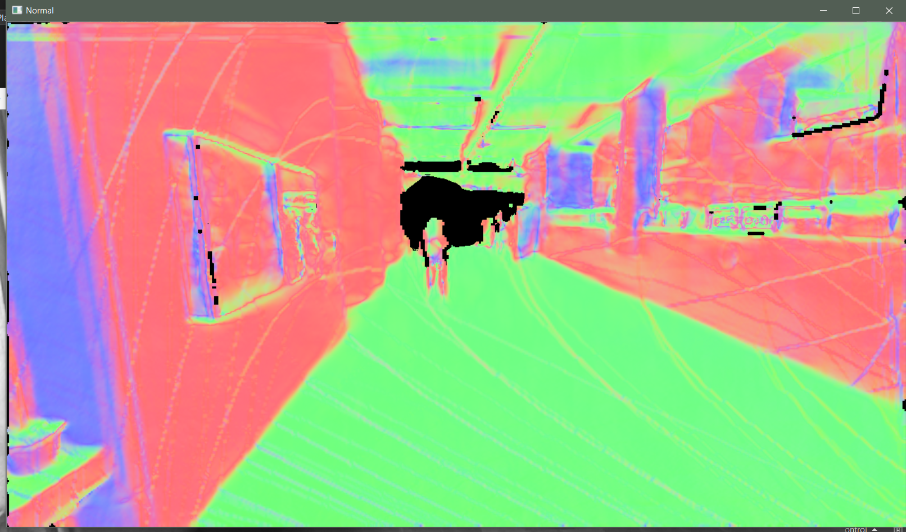
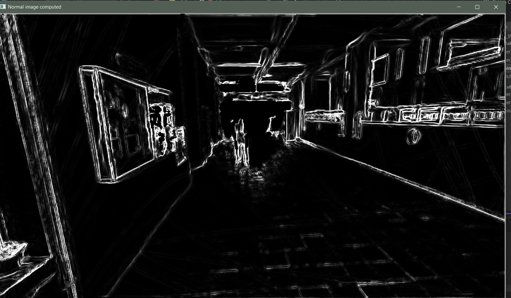
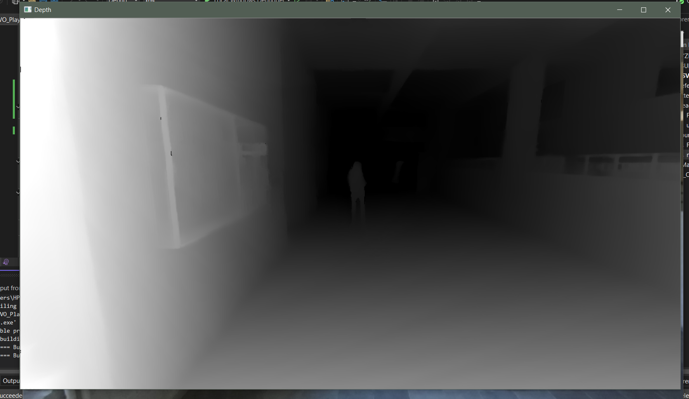

# ZED SVO Playback & Advanced Image Segmentation

This project provides a robust pipeline for reading `.svo` video files captured with STEREOLABS ZED cameras and performing advanced image processing and segmentation with OpenCV. It includes real-time visualization, a variety of filtering methods, computation of surface normals, and segmentation using BFS with seed points, among others.

---

## Table of Contents

- [About the Project](#about-the-project)
- [Requirements](#requirements)
- [Installation](#installation)
- [Usage](#usage)
- [Features & Theory](#features--theory)
- [Examples](#examples)
- [Project Structure](#project-structure)
- [License](#license)

---

## About the Project

This application demonstrates how to process `.svo` video files from STEREOLABS ZED cameras, extract and process frames, apply a range of filters, compute geometric information such as surface normals, and perform segmentation based on both intensity and geometry. The project is designed for research, prototyping, and education in computer vision and 3D scene understanding.

---

## Requirements

- [ZED SDK](https://www.stereolabs.com/developers/) (tested with version XX)
- [OpenCV](https://opencv.org/) (tested with version XX)
- [Git LFS](https://git-lfs.github.com/) (**required for large `.svo` files**)
- CMake & a C++ compiler (Visual Studio recommended for Windows)

---

## Installation

```bash
git lfs install
git clone https://github.com/banescuema101/Images_Processing_Segmentation_ZED_OpenCV.git
cd Images_Processing_Segmentation_ZED_OpenCV
```
- Install ZED SDK and OpenCV for your system.
- Build the project using CMake and your preferred IDE.

---

## Usage

### Run from the command line:
```bash
ZED_SVO_Playback.exe svo_files/file1.svo
```
- If no argument is given, the default is `svo_files/file1.svo`
- You can provide any `.svo` file as an argument (relative or absolute path)

### Run from Visual Studio:
- Right-click the `ZED_SVO_Playback` project → Properties → Debugging → Command Arguments  
  Set to e.g. `svo_files/file1.svo` and run with F5.

---

## Features & Theory

### Core Functions (Filter.cpp) and Underlying Theory

#### 1. **Grayscale Median Filter**
   - **Function:** `filterGrayscaleMedianFilter`
   - **About:** Reduces noise by replacing each pixel’s value with the median of its neighborhood. Effective for salt-and-pepper noise.
   - **Usage:** Applied to grayscale images to smooth while preserving edges.

#### 2. **Grayscale Sobel Filter**
   - **Function:** `filterGrayscaleSobel`
   - **About:** Computes the gradient magnitude using Sobel operators in X and Y directions, highlighting image edges.
   - **Usage:** Useful for edge detection and feature extraction.

#### 3. **Color Average Filter**
   - **Function:** `filterColorAverage`
   - **About:** Applies a box blur (mean filter) to color images. Each output pixel is the average of its neighborhood.
   - **Usage:** Smooths color images, reducing noise but blurring edges.

#### 4. **Depth Gaussian/Prewitt Filters**
   - **Functions:** `filterDepthGaussian`, `filterDepthPrewitt`
   - **About:**  
     - *Gaussian*: Weighted average, more weight to central pixels; great for noise reduction.
     - *Prewitt*: Computes gradient like Sobel, but with a simpler kernel.
   - **Usage:** Applied to depth maps for smoothing or edge detection.

#### 5. **Normal Computation**
   - **Functions:** `computeNormals`, `computeNormals5x5Vicinity`
   - **About:** Computes per-pixel surface normals using local neighborhoods in the 3D point cloud.  
     - *3x3 or 5x5 window*: Fit a plane to local points, normal is perpendicular to the plane.
   - **Applications:** Surface analysis, segmentation, and 3D understanding.

#### 6. **Normals to Image**
   - **Function:** `transformNormalsToImage`
   - **About:** Maps normal vectors to RGB color for visualization (e.g., using the components as R,G,B).
   - **Usage:** Visualizes orientation of surfaces.

#### 7. **Normal Sobel Filter**
   - **Function:** `filterNormalSobel`
   - **About:** Applies edge detection on normal maps to highlight geometric features.
   - **Usage:** Detects changes in surface orientation.

#### 8. **BFS Segmentation from Seeds**
   - **Function:** `segmentBFSFromSeeds`
   - **About:** Implements seeded region growing using Breadth-First Search.  
     - Pixels are grouped based on similarity in intensity, depth, and surface normal direction.
     - Weights (`w1`, `w2`, `w3`) control the importance of each cue.
     - Seeds are usually chosen randomly or using heuristics.
   - **Applications:** Semantic segmentation, object separation, scene parsing.

#### 9. **Labels to Color Image**
   - **Function:** `labelsToColorImage`
   - **About:** Maps segmentation labels to unique colors for easy visualization.
   - **Usage:** Shows segmented regions with different colors.

---

## Examples

Below are some results generated by this project.  
**Place your images in the `examples/` folder and update the links below.**

### 1. BFS Segmentation with Seed Points


> Segmentation using BFS region growing with 40 seed points.

### 2. Surface Normal Map


> Computed surface normals visualized as an RGB image.

### 3. Grayscale Sobel Edge Detection


> Edges detected on the grayscale image using Sobel filter.

### 4. Depth Map Visualization


> Depth map extracted from SVO file, color-mapped for visualization.

### 5. Color Segmentation Output


> Color-coded segmentation result, each region gets a unique color.

---

## Project Structure

```
Images_Processing_Segmentation_ZED_OpenCV/
|-- svo_files/           # SVO files (tracked via Git LFS)
|-- examples/            # Example output images for documentation
|-- main.cpp             # Main program entry point
|-- Filter.cpp/h         # Filtering, normals, segmentation algorithms
|-- utils.hpp            # Utility functions
|-- CMakeLists.txt       # CMake build configuration
|-- README.md            # This file
```

---

## License

- Code and sample data © 2024 STEREOLABS and contributors.  
- Provided under the STEREOLABS license.  
- See source comments and LICENSE file for usage restrictions.

---

## Acknowledgments

- [STEREOLABS ZED SDK](https://www.stereolabs.com/zed/)
- [OpenCV](https://opencv.org/)
